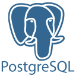
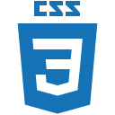

# Hi there 👋

## My languages and tools are:

   

## In the future I am willing to 
- Improve my understanding of:
    - 
        - Design patterns
        - Testing (unit, integration)
        - Project structure approaches
        - CI/CD
        - Docker 
- Take part in
    -   
        - Commercial development
        - Team development
- Learn
    -
        - Automapper
        - React / Angular / Vue (one of, preference is React for now)
# My Projects:
## [WonderlandChip WEB API - March, 2023](https://github.com/KozhokarIvan/WonderlandChip)